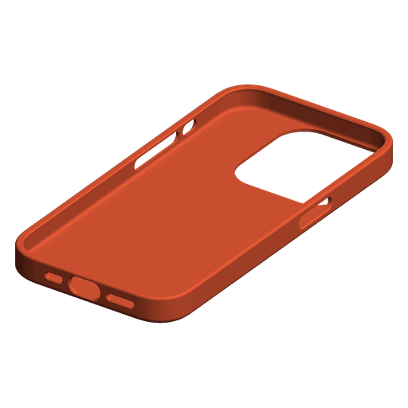

# Cover iPhone 15 Pro – file di stampa 3D



| File | A cosa serve |
|------|--------------|
| `cover_iphone15pro.3mf` | Da aprire in **Bambu Studio** (File → Apri progetto / trascina nella finestra) |
| `cover_iphone15pro.stl` | Formato universale (Bambu Studio, OrcaSlicer, PrusaSlicer, caricamento su MakerWorld) |
| `cover_iphone15pro.usdz` | Vista 3D / AR su iPhone: aprilo dall'app File e tocca l'icona AR per vederla in scala 1:1 |
| `genera_cover.py` | Sorgente parametrico che rigenera tutti i file |

## Caratteristiche

- Misure prese dal **disegno dimensionale ufficiale Apple** dell'iPhone 15 Pro
  (70,60 × 146,61 × 8,25 mm, angoli a curvatura continua, profilo dei bordi).
- Pareti 1,6 mm, dorso 1,5 mm (Apple consiglia max 2,1 mm per non disturbare MagSafe e
  la ricarica wireless).
- Bordino di 0,85 mm sopra il vetro che protegge lo schermo appoggiato sul tavolo e
  copre solo la parte curva del vetro (1,3 mm dal bordo, l'area attiva inizia a 2,76 mm).
- Aperture per il tasto Azione, i volumi, il tasto laterale, USB-C (13,6 × 7,2 mm, più grande
  della zona libera raccomandata da Apple di 12,45 × 6,60 mm), microfoni e altoparlante.
- Apertura fotocamera che lascia libero tutto il rialzo delle fotocamere (44 × 45,5 mm + 0,5 mm di margine).
- Gioco di 0,15 mm per lato: aderente ma infilabile.
- Ingombro 74,1 × 150,1 × 10,9 mm, circa 24 g in TPU.

Verificato al computer: il telefono, il rialzo delle fotocamere (fino all'altezza delle lenti), i
tasti, i fori di microfoni e altoparlante e la zona del connettore USB-C non toccano la cover.
La mesh è chiusa e senza errori.

## Impostazioni di stampa consigliate (Bambu Studio)

- **Materiale: TPU 95A** (es. Bambu TPU 95A HF). Non usare PLA o PETG: sono rigidi e il bordino
  non lascerebbe entrare il telefono.
- Carica il TPU morbido dal **portabobina esterno**, non dall'AMS.
- Orientamento: così come si apre, **con il dorso sul piatto**. **Nessun supporto.**
- Piatto: Textured PEI (il dorso viene con una bella texture opaca).
- Altezza strato: 0,16–0,20 mm.
- Pareti: 4 perimetri; strati superiori/inferiori: 8 (oppure riempimento al 100%).
- Velocità e temperature: il profilo TPU di Bambu Studio va già bene.

## Vederla su Bambu Handy

Bambu Handy non apre direttamente file STL/3MF salvati sul telefono: mostra i modelli di
MakerWorld e i file già slicati. Quindi:

1. Apri `cover_iphone15pro.3mf` in Bambu Studio, scegli stampante e TPU, premi **Slice piatto**.
2. Premi **Stampa piatto** (o **Invia** per salvarlo nella memoria della stampante).
3. In Bambu Handy la trovi nella cronologia di stampa o tra i file della stampante, con l'anteprima,
   e puoi ristamparla dal telefono quando vuoi.

In alternativa puoi caricare l'STL su MakerWorld (anche come bozza privata) per vederlo nel
visualizzatore 3D di Handy. Per ruotare il modello sull'iPhone senza stampante usa il file `.usdz`.

## Modificare la cover

Tutte le misure sono parametri in cima a `genera_cover.py` (gioco, spessori, bordino, raggi).

```bash
pip install manifold3d numpy pillow usd-core
python3 genera_cover.py
```

Se la cover risulta troppo stretta aumenta `CLEAR_XY` (es. 0.25); se balla riducilo (es. 0.05).
